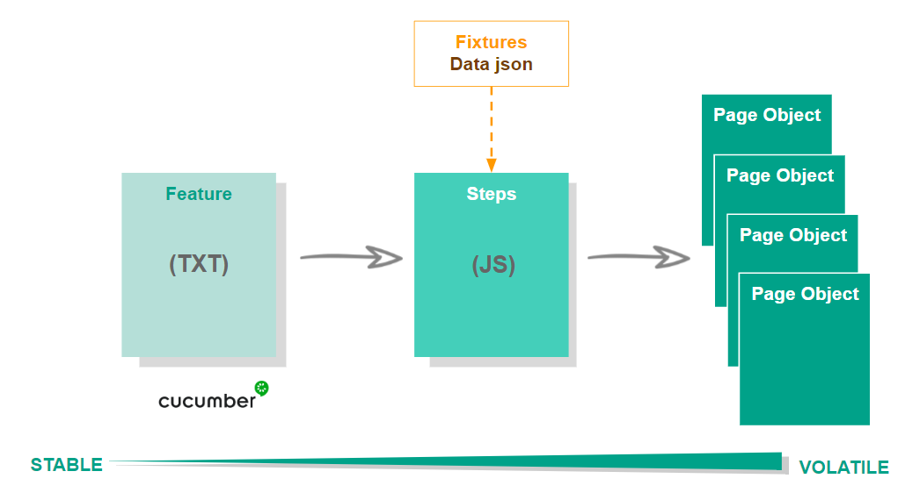

# Tests front - Demo LM



## Features

L'ensemble des tests sont stockés dans le dossier "cypress > integration > features". Ils sont écrits au format **Gherkin**.
L'objectif est de les organiser et écrire de maniére fonctionnelle / métier.

Pour cela chaque feature est composée d'un titre, d'une description (optionnelle) et d'un ensemble de scenarios permettant de la valider : 
Chaque scenario est décrit en langage Gherkin, en utilisant les termes métier avec les mots-clés suivants :

```gherkin
Scenario : titre du scenario

Given : l'état de départ du scenario : connexion, pré-requis jdd...

When : l'ensemble des actions à réaliser tel qu'un utilisateur métier le ferait

Then : la ou les vérifications à faire
```

Chaque étape décrite doit etre suffisamment générique pour etre réutilisable (variabilisation des données, utilisation des mêmes mots clés, pas de termes trop techniques). C'est le plugin cucumber qui permet de lire ces fichiers. Chacune de ces étapes va etre également définie dans les steps (paragraphe suivant).

> HOW TO Get QRM Gherkin \
WIP
Le référentiel du Code Gherkin est stocké sur Jira, la CI récupère automatiquement ce code. \
En tant que développeur/automatien, récupérer le ZIP depuis l'URL et coller le contenu du ZIP dans le répertoire <>

## Steps et Pages

Afin de pouvoir associer les étapes écrites en langage métier dans les features au code de test, on doit les définir dans les steps.
Les steps sont stockées dans le dossier "cypress > integration > steps". Comme pour les features, les steps sont organisées de maniére fonctionnelle.
Pour chaque step on va retrouver sa définition sous ce format :

```gherkin
<Mot clé de l étape>('Phrase de l'étape telle qu'elle apparait dans la feature', (variable si jdd) =>{
    récupération et/ou manipulation des données
    appel du code de test
})
```

Le code de test n'est pas directement appelé dans les steps. Pour ca on utilise le Page Object Pattern. Cela consiste en l'organisation du code de test non plus de maniére fonctionnelle mais selon les pages de l'application. L'objectif étant d'éviter la duplication de code et ainsi faciliter la maintenance des tests.

Le code de test se trouve dans le dossier **"cypress > integration > pages"**

Les fonctions contenues dans les pages doivent rester le plus unitaires possible afin de pouvoir les réutiliser dans différentes steps. 
L'objectif de ces fonctions est de chercher l'élément sur l'application avec lequel on souhaite interragir (via xpath ou css selector) puis d'indiquer l'action à réaliser (type, click, wait...)

Afin de faciliter la maintenance des tests, des attributs tnr-id ont été ajoutés sur les éléments du front. Pour récupérer ces éléments on peut utiliser le selecteur suivant : '*[tnr-id="valeur_du_tnr_id"]'

## Gestion des données de test :

Afin de pouvoir respecter les normes du Gherkin (description des scenarios par l'exemple), les données sont définies en dur dans les features.

Pour que cela n'augmente pas la difficulté de maintenance des tests, un script "data > setDatas.js" d'initialisation des données est éxécuté avant chaque éxécution de test. Ce script permet également de nettoyer les données créés par les tests afin de ne pas polluer les bases.

Certaines données n'étant pas liées à des scenarios sont stockées dans le dossier "fixtures".

## Execution des tests

Pour exécuter les tests en local il y a deux solutions :

**via ligne de commande**

```bash
- dans une console exécuter depuis le dossier "cypress-cucumber-LMdemo" : npm run test
- pour exectuer une spec en particulier en headless :  npx cypress run --e2e -b chrome --env urlenv={url} --spec 'path relatif de la spec'
- les résultats s'affichent dans la console mais il est également possible de générer un rapport cucumber : node ./report.js
- le rapport est généré dans le dossier : /cypress-cucumber-LMdemo/target
```

**via l'interface cypress :**

```bash
- dans une console exécuter depuis le dossier "test-front" : npx cypress open --e2e -b chrome --env urlenv={url de l'environnement}
- modifier les url dans la step de login (elles sont variabilisées et passées en paramétre d'exécution). Afin de pouvoir fonctionner dans l'interface il faut les ajouter en dur et ne pas pusher les modif.
- une fois l'interface ouverte, cliquer sur la feature pour lancer les tests souhaités
```
